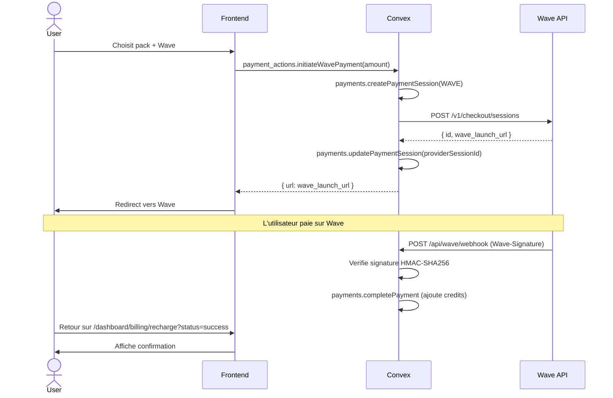
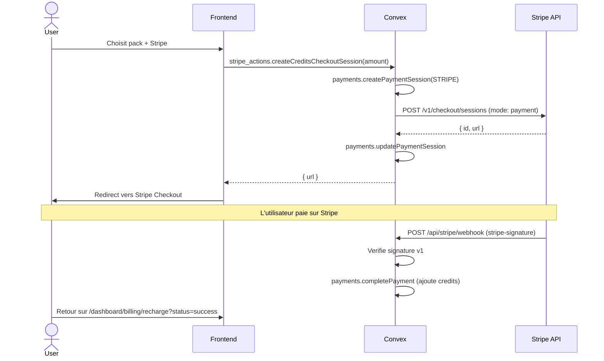

# Guide d'integration des providers de paiement

Ce document decrit comment configurer et integrer les providers de paiement disponibles dans Jokko pour la recharge de credits.

## Architecture generale

Le systeme de paiement de Jokko est **provider-agnostic**. Chaque paiement suit le meme cycle :

```
[Dialog Recharge] → [Action Convex] → [API Provider] → [Redirect utilisateur] → [Webhook] → [Credits ajoutes]
```

### Table `paymentSessions`

Chaque paiement cree une session dans la table `paymentSessions` avec :
- `provider` : `"WAVE"` | `"ORANGE_MONEY"` | `"STRIPE"`
- `status` : `"PENDING"` → `"COMPLETED"` | `"FAILED"` | `"EXPIRED"`
- `amount` / `credits` : montant en FCFA et credits correspondants (1:1)
- `providerSessionId` : ID de session cote provider
- `webhookEventId` : pour l'idempotence des webhooks

### Fichiers cles

| Fichier | Role |
|---------|------|
| `convex/payment_actions.ts` | Actions pour Wave et Orange Money |
| `convex/stripe_actions.ts` | Actions pour Stripe (checkout + abonnements) |
| `convex/payments.ts` | Mutations communes (create, complete, fail, expire) |
| `convex/http.ts` | Webhooks (Wave, Stripe, Orange Money) |
| `lib/credit-packs.ts` | Packs de credits et conversion montants |
| `app/dashboard/billing/_components/recharge-dialog.tsx` | UI du dialog de recharge |
| `app/dashboard/billing/recharge/_recharge-content.tsx` | Page de statut apres paiement |

### Packs de credits disponibles

| Pack | Montant FCFA | Credits | Messages estimes |
|------|-------------|---------|-----------------|
| 5K | 5 000 | 5 000 | ~83 |
| 10K | 10 000 | 10 000 | ~166 |
| 25K | 25 000 | 25 000 | ~416 |
| 50K | 50 000 | 50 000 | ~833 |
| 100K | 100 000 | 100 000 | ~1 666 |

---

## 1. Wave

**Statut : Fonctionnel**

### Prerequis

1. Creer un compte marchand sur [Wave Business](https://business.wave.com)
2. Activer l'API dans **Settings > API**
3. Configurer le webhook URL

### Variables d'environnement Convex

```bash
pnpx convex env set WAVE_API_KEY "wv_live_..."
pnpx convex env set WAVE_WEBHOOK_SECRET "whsec_..."
```

### Webhook URL a configurer dans Wave

```
https://<deployment>.convex.site/api/wave/webhook
```

Remplacer `<deployment>` par le hostname Convex du projet (ex: `befitting-hornet-738.convex.site` en dev, le domaine de production en prod).

### Flux technique



### API Wave

**Endpoint :** `POST https://api.wave.com/v1/checkout/sessions`

```json
{
  "amount": "10000",
  "currency": "XOF",
  "client_reference": "PAY-XXXX",
  "success_url": "https://slug.jokko.co/dashboard/billing/recharge?session=...&status=success",
  "error_url": "https://slug.jokko.co/dashboard/billing/recharge?session=...&status=error"
}
```

**Reponse :** `{ "id": "...", "wave_launch_url": "https://pay.wave.com/...", "checkout_status": "open" }`

### Signature webhook

Format du header `Wave-Signature` : `t={timestamp},v1={signature}`

Verification : `HMAC-SHA256(webhook_secret, "{timestamp}.{body}")`

---

## 2. Stripe

**Statut : Fonctionnel**

### Prerequis

1. Creer un compte sur [Stripe Dashboard](https://dashboard.stripe.com)
2. Recuperer les cles API dans **Developers > API Keys**
3. Configurer le webhook dans **Developers > Webhooks**

### Variables d'environnement Convex

```bash
pnpx convex env set STRIPE_SECRET_KEY "sk_live_..."
pnpx convex env set STRIPE_WEBHOOK_SECRET "whsec_..."
```

### Webhook URL

```
https://<deployment>.convex.site/api/stripe/webhook
```

Events a ecouter :
- `checkout.session.completed`
- `checkout.session.async_payment_succeeded`
- `checkout.session.async_payment_failed`
- `customer.subscription.created`
- `customer.subscription.updated`
- `customer.subscription.deleted`

### Flux technique (recharge credits)



### Particularite devise XOF

XOF est une devise a 2 decimales dans Stripe. Le montant doit etre multiplie par 100 :

```typescript
unit_amount: args.amount * 100  // 5000 FCFA = 500000
```

La fonction `toProviderAmount()` dans `lib/credit-packs.ts` gere cette conversion.

---

## 3. Orange Money

**Statut : A implementer**

L'action `initiateOrangeMoneyPayment` dans `convex/payment_actions.ts` est un stub qui lance une erreur. Le dialog affiche le provider mais il est desactive avec le label "Bientot disponible".

### Prerequis

1. S'inscrire sur le [Orange Developer Portal](https://developer.orange.com)
2. Creer une application avec le produit **Orange Money Webpay**
3. Faire valider le compte marchand pour le Senegal
4. Recuperer les credentials (Client ID, Client Secret, Merchant Key)

### Variables d'environnement Convex

```bash
pnpx convex env set ORANGE_MONEY_CLIENT_ID "..."
pnpx convex env set ORANGE_MONEY_CLIENT_SECRET "..."
pnpx convex env set ORANGE_MONEY_MERCHANT_KEY "..."
```

### Flux a implementer

#### Etape 1 : Obtenir un token OAuth

```
POST https://api.orange.com/oauth/v3/token
Authorization: Basic base64({client_id}:{client_secret})
Content-Type: application/x-www-form-urlencoded

grant_type=client_credentials
```

Reponse : `{ "access_token": "...", "token_type": "Bearer", "expires_in": 3600 }`

#### Etape 2 : Initier le paiement

```
POST https://api.orange.com/orange-money-webpay/dev/v1/webpayment
Authorization: Bearer {access_token}
Content-Type: application/json

{
  "merchant_key": "...",
  "currency": "OUV",
  "order_id": "PAY-XXXX",
  "amount": 5000,
  "return_url": "https://slug.jokko.co/dashboard/billing/recharge?session=...&status=success",
  "cancel_url": "https://slug.jokko.co/dashboard/billing/recharge?session=...&status=cancel",
  "notif_url": "https://<deployment>.convex.site/api/orange-money/webhook",
  "lang": "fr"
}
```

Reponse : `{ "status": 201, "payment_url": "https://...", "pay_token": "...", "notif_token": "..." }`

#### Etape 3 : Redirect

Rediriger l'utilisateur vers `payment_url`. Il complete le paiement sur la page Orange Money.

#### Etape 4 : Webhook

Orange Money envoie un POST a `notif_url` avec le statut du paiement :
- `SUCCESS` → appeler `payments.completePayment`
- `FAILED` / `CANCELLED` → appeler `payments.failPayment`

### Fichiers a modifier

1. **`convex/payment_actions.ts`** : Implementer `initiateOrangeMoneyPayment` (remplacer le stub)
2. **`convex/http.ts`** : Ajouter la route `/api/orange-money/webhook`
3. **`app/dashboard/billing/_components/recharge-dialog.tsx`** : Retirer la condition `disabled` sur Orange Money

### Environnements Orange Money

| Environnement | Base URL |
|--------------|----------|
| Sandbox | `https://api.orange.com/orange-money-webpay/dev/v1/` |
| Production | `https://api.orange.com/orange-money-webpay/v1/` |

Commencer en sandbox pour tester, puis basculer en production apres validation.

---

## Securite

### Verification des webhooks

Les 3 providers utilisent une verification HMAC-SHA256 :

| Provider | Header | Format |
|----------|--------|--------|
| Wave | `Wave-Signature` | `t={ts},v1={sig}` |
| Stripe | `stripe-signature` | `t={ts},v1={sig}` |
| Orange Money | `notif_token` | Token a valider |

Toutes les verifications sont implementees avec Web Crypto API (compatible Convex edge runtime).

### Idempotence

Le champ `webhookEventId` dans `paymentSessions` empeche le traitement en double d'un meme evenement webhook. La mutation `completePayment` verifie :
1. Le statut n'est pas deja `COMPLETED`
2. Le `webhookEventId` n'a pas deja ete traite

### Expiration des sessions

Un cron (`convex/crons.ts`) expire automatiquement les sessions `PENDING` de plus de 30 minutes via `payments.expirePaymentSessions`.

---

## Ajouter un nouveau provider

Pour ajouter un 4e provider :

1. Ajouter le provider dans le type `PaymentProvider` du schema (`convex/schema.ts`)
2. Creer l'action dans `convex/payment_actions.ts`
3. Ajouter le webhook dans `convex/http.ts`
4. Ajouter le provider dans `lib/credit-packs.ts` (icone, gradient, `toProviderAmount`)
5. Ajouter le provider dans le dialog de recharge
6. Deployer et configurer les variables d'environnement
