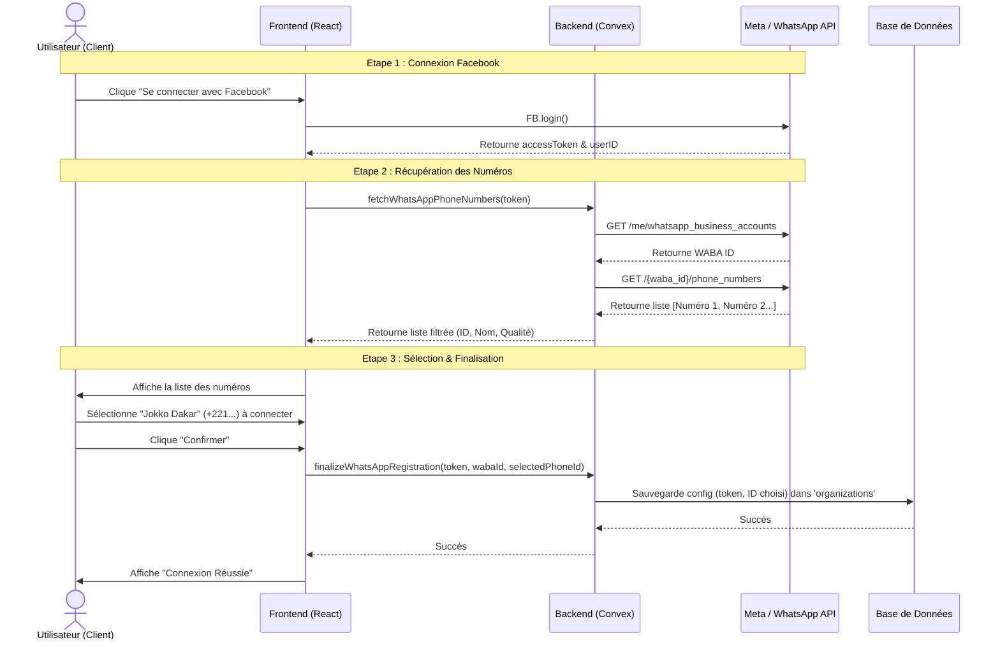

# Architecture : Connexion WhatsApp (Embedded Signup avec Sélection)

Ce diagramme explique le flux de données entre le Client (Frontend), notre Serveur (Convex) et Meta (WhatsApp API) suite aux récentes améliorations.

## Diagramme de Séquence

## Points Clés
1.  **Séparation des responsabilités :** Le Backend ne sauvegarde rien tant que l'utilisateur n'a pas choisi.
2.  **Transparence :** L'utilisateur voit exactement quel numéro (et sa qualité) sera connecté.
3.  **Sécurité :** Le token est validé deux fois (une fois pour lire, une fois pour l'enregistrement).
