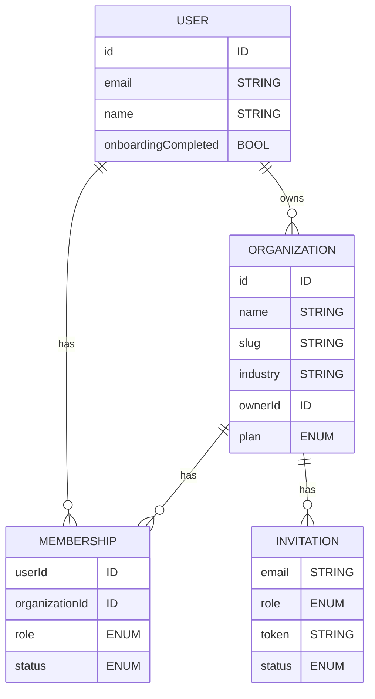
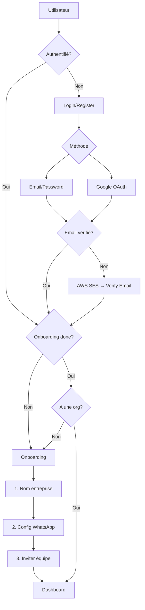
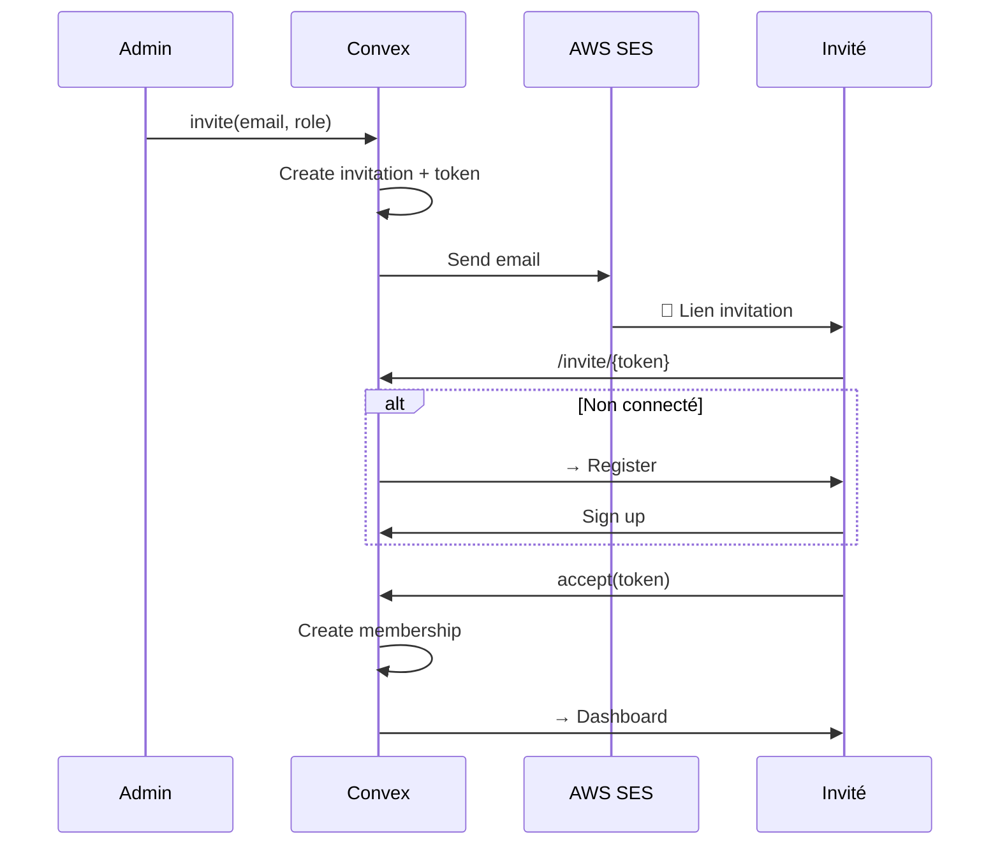
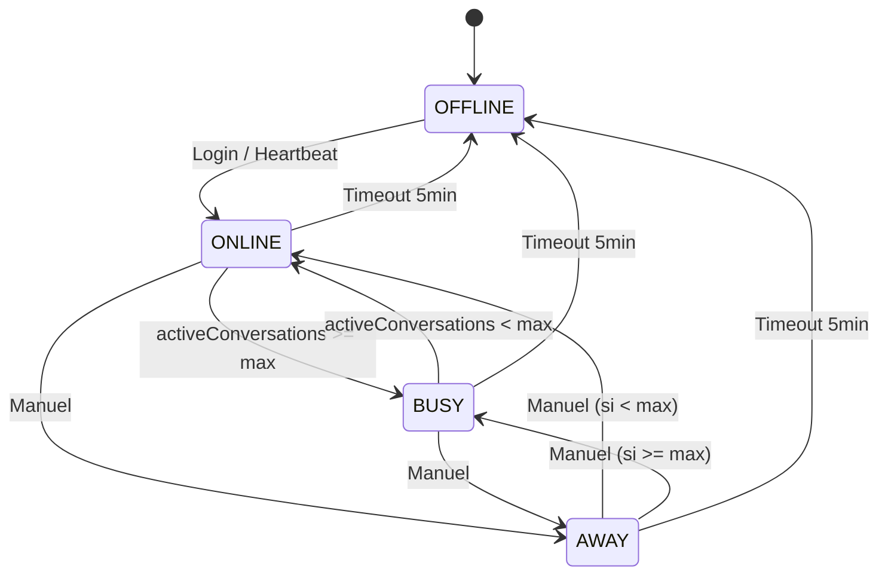

# Prompt : Authentification & Organisations - Jokko v2

## Contexte

Jokko est une plateforme SaaS multi-tenant permettant à **toute entreprise** (tout secteur) de gérer ses conversations WhatsApp Business professionnellement. L'architecture est basée sur **Next.js 16 + Convex**.

### Modèle Multi-Tenant

- **Organisation** = Entreprise/Business (tenant)
- Un **User** peut appartenir à **plusieurs organisations** (1-4 entreprises)
- Chaque organisation a ses propres **conversations, contacts, templates, etc.**
- Les données sont **isolées** par organisation

---

## Stack

| Service | Technologie |
|---------|-------------|
| Frontend | Next.js 16 (App Router) |
| Backend/DB | Convex |
| Auth | Convex Auth |
| Emails | **AWS SES** |
| Real-time | Convex Subscriptions |
| Files | Convex File Storage |

---

## 1. Schéma de Données

```typescript
// convex/schema.ts
import { defineSchema, defineTable } from "convex/server";
import { v } from "convex/values";
import { authTables } from "@convex-dev/auth/server";

export default defineSchema({
  ...authTables,

  // ============================================
  // Users
  // ============================================
  users: defineTable({
    name: v.optional(v.string()),
    email: v.string(),
    image: v.optional(v.string()),
    emailVerificationTime: v.optional(v.number()),
    phone: v.optional(v.string()),
    locale: v.optional(v.string()),
    timezone: v.optional(v.string()),
    onboardingCompleted: v.boolean(),
    createdAt: v.number(),
    updatedAt: v.number(),
  }).index("by_email", ["email"]),

  // ============================================
  // Organizations (Entreprises - Tenants)
  // ============================================
  organizations: defineTable({
    name: v.string(),
    slug: v.string(),
    logo: v.optional(v.id("_storage")),
    industry: v.optional(v.string()), // "retail", "healthcare", "finance", "education", etc.
    ownerId: v.id("users"),
    // WhatsApp Config
    whatsapp: v.optional(v.object({
      phoneNumberId: v.string(),
      businessAccountId: v.string(),
      accessToken: v.string(),
      webhookVerifyToken: v.string(),
      displayPhoneNumber: v.optional(v.string()),
      verifiedName: v.optional(v.string()),
    })),
    settings: v.optional(v.object({
      businessHours: v.optional(v.any()),
      autoReplyEnabled: v.optional(v.boolean()),
      autoReplyMessage: v.optional(v.string()),
      defaultLanguage: v.optional(v.string()),
    })),
    plan: v.union(
      v.literal("FREE"),
      v.literal("STARTER"),
      v.literal("PRO"),
      v.literal("ENTERPRISE")
    ),
    createdAt: v.number(),
    updatedAt: v.number(),
  })
    .index("by_owner", ["ownerId"])
    .index("by_slug", ["slug"]),

  // ============================================
  // Memberships (User <-> Organization)
  // ============================================
  memberships: defineTable({
    userId: v.id("users"),
    organizationId: v.id("organizations"),
    role: v.union(v.literal("OWNER"), v.literal("ADMIN"), v.literal("AGENT")),
    // Presence
    status: v.union(
      v.literal("ONLINE"),
      v.literal("BUSY"),
      v.literal("AWAY"),
      v.literal("OFFLINE")
    ),
    statusMessage: v.optional(v.string()),
    maxConversations: v.number(),
    activeConversations: v.number(),
    lastSeenAt: v.number(),
    joinedAt: v.number(),
    invitedById: v.optional(v.id("users")),
  })
    .index("by_user", ["userId"])
    .index("by_organization", ["organizationId"])
    .index("by_user_org", ["userId", "organizationId"])
    .index("by_org_status", ["organizationId", "status"]),

  // ============================================
  // Invitations
  // ============================================
  invitations: defineTable({
    organizationId: v.id("organizations"),
    email: v.string(),
    role: v.union(v.literal("ADMIN"), v.literal("AGENT")),
    token: v.string(),
    status: v.union(
      v.literal("PENDING"),
      v.literal("ACCEPTED"),
      v.literal("EXPIRED"),
      v.literal("CANCELLED")
    ),
    invitedById: v.id("users"),
    expiresAt: v.number(),
    acceptedAt: v.optional(v.number()),
    createdAt: v.number(),
  })
    .index("by_organization", ["organizationId"])
    .index("by_token", ["token"])
    .index("by_org_status", ["organizationId", "status"]),

  // ============================================
  // User Sessions (current org)
  // ============================================
  userSessions: defineTable({
    userId: v.id("users"),
    currentOrganizationId: v.optional(v.id("organizations")),
    lastActivityAt: v.number(),
  }).index("by_user", ["userId"]),
});
```

---

## 2. Rôles & Permissions

```typescript
// convex/lib/permissions.ts

export type Role = "OWNER" | "ADMIN" | "AGENT";

export type Permission =
  | "org:read" | "org:update" | "org:delete" | "org:billing"
  | "members:read" | "members:invite" | "members:remove" | "members:update_role"
  | "conversations:read_all" | "conversations:read_assigned" | "conversations:assign" | "conversations:update"
  | "messages:read" | "messages:send"
  | "templates:read" | "templates:create" | "templates:update" | "templates:delete"
  | "contacts:read" | "contacts:create" | "contacts:update" | "contacts:delete" | "contacts:import" | "contacts:export"
  | "flows:read" | "flows:create" | "flows:update" | "flows:delete"
  | "settings:read" | "settings:update" | "settings:whatsapp";

const ROLE_PERMISSIONS: Record<Role, Permission[]> = {
  OWNER: [
    "org:read", "org:update", "org:delete", "org:billing",
    "members:read", "members:invite", "members:remove", "members:update_role",
    "conversations:read_all", "conversations:assign", "conversations:update",
    "messages:read", "messages:send",
    "templates:read", "templates:create", "templates:update", "templates:delete",
    "contacts:read", "contacts:create", "contacts:update", "contacts:delete", "contacts:import", "contacts:export",
    "flows:read", "flows:create", "flows:update", "flows:delete",
    "settings:read", "settings:update", "settings:whatsapp",
  ],
  ADMIN: [
    "org:read", "org:update",
    "members:read", "members:invite", "members:remove",
    "conversations:read_all", "conversations:assign", "conversations:update",
    "messages:read", "messages:send",
    "templates:read", "templates:create", "templates:update", "templates:delete",
    "contacts:read", "contacts:create", "contacts:update", "contacts:delete", "contacts:import", "contacts:export",
    "flows:read", "flows:create", "flows:update", "flows:delete",
    "settings:read", "settings:update",
  ],
  AGENT: [
    "org:read",
    "members:read",
    "conversations:read_assigned", "conversations:update",
    "messages:read", "messages:send",
    "templates:read",
    "contacts:read", "contacts:create", "contacts:update",
    "flows:read",
    "settings:read",
  ],
};

export const hasPermission = (role: Role, permission: Permission): boolean =>
  ROLE_PERMISSIONS[role].includes(permission);

export const canSeeAllConversations = (role: Role): boolean =>
  hasPermission(role, "conversations:read_all");
```

---

## 3. AWS SES + React Email

### Installation

```bash
pnpm add @react-email/components react-email
```

### Structure

```
emails/
├── components/
│   ├── layout.tsx        # Layout commun
│   ├── button.tsx        # Bouton réutilisable
│   └── footer.tsx        # Footer commun
├── invitation.tsx        # Email invitation
├── verification.tsx      # Email vérification
└── password-reset.tsx    # Email reset password
```

### Layout Commun

```tsx
// emails/components/layout.tsx
import {
  Body,
  Container,
  Head,
  Html,
  Preview,
  Section,
  Tailwind,
} from "@react-email/components";
import * as React from "react";

interface LayoutProps {
  preview: string;
  children: React.ReactNode;
}

export function Layout({ preview, children }: LayoutProps) {
  return (
    <Html>
      <Head />
      <Preview>{preview}</Preview>
      <Tailwind>
        <Body className="bg-slate-100 font-sans">
          <Container className="mx-auto py-10 px-4">
            <Section className="bg-white rounded-xl p-10 shadow-sm">
              {children}
            </Section>
            <Footer />
          </Container>
        </Body>
      </Tailwind>
    </Html>
  );
}

function Footer() {
  return (
    <Section className="text-center mt-8">
      <Text className="text-slate-400 text-xs">
        © {new Date().getFullYear()} Jokko. Tous droits réservés.
      </Text>
    </Section>
  );
}
```

### Bouton Réutilisable

```tsx
// emails/components/button.tsx
import { Button as EmailButton } from "@react-email/components";
import * as React from "react";

interface ButtonProps {
  href: string;
  children: React.ReactNode;
}

export function Button({ href, children }: ButtonProps) {
  return (
    <EmailButton
      href={href}
      className="bg-emerald-500 text-white px-7 py-3.5 rounded-lg font-semibold text-sm no-underline text-center block"
    >
      {children}
    </EmailButton>
  );
}
```

### Email Invitation

```tsx
// emails/invitation.tsx
import {
  Heading,
  Text,
  Section,
} from "@react-email/components";
import * as React from "react";
import { Layout } from "./components/layout";
import { Button } from "./components/button";

interface InvitationEmailProps {
  orgName: string;
  inviterName: string;
  role: "ADMIN" | "AGENT";
  inviteUrl: string;
}

export function InvitationEmail({
  orgName,
  inviterName,
  role,
  inviteUrl,
}: InvitationEmailProps) {
  const roleLabel = role === "ADMIN" ? "Administrateur" : "Agent";

  return (
    <Layout preview={`${inviterName} vous invite à rejoindre ${orgName}`}>
      <Heading className="text-2xl font-bold text-slate-900 m-0 mb-6">
        Rejoignez {orgName}
      </Heading>

      <Text className="text-slate-600 leading-relaxed m-0 mb-4">
        <strong>{inviterName}</strong> vous invite à rejoindre{" "}
        <strong>{orgName}</strong> sur Jokko en tant que{" "}
        <strong>{roleLabel}</strong>.
      </Text>

      <Text className="text-slate-600 leading-relaxed m-0 mb-8">
        Jokko permet de gérer vos conversations WhatsApp Business de manière
        professionnelle avec votre équipe.
      </Text>

      <Section className="text-center mb-8">
        <Button href={inviteUrl}>Accepter l'invitation</Button>
      </Section>

      <Text className="text-slate-400 text-xs m-0">
        Ce lien expire dans 7 jours. Si vous n'avez pas demandé cette
        invitation, ignorez cet email.
      </Text>
    </Layout>
  );
}

export default InvitationEmail;
```

### Email Vérification

```tsx
// emails/verification.tsx
import {
  Heading,
  Text,
  Section,
} from "@react-email/components";
import * as React from "react";
import { Layout } from "./components/layout";
import { Button } from "./components/button";

interface VerificationEmailProps {
  verifyUrl: string;
}

export function VerificationEmail({ verifyUrl }: VerificationEmailProps) {
  return (
    <Layout preview="Vérifiez votre adresse email">
      <Heading className="text-2xl font-bold text-slate-900 m-0 mb-6">
        Vérifiez votre email
      </Heading>

      <Text className="text-slate-600 leading-relaxed m-0 mb-8">
        Cliquez sur le bouton ci-dessous pour confirmer votre adresse email et
        activer votre compte Jokko.
      </Text>

      <Section className="text-center mb-8">
        <Button href={verifyUrl}>Vérifier mon email</Button>
      </Section>

      <Text className="text-slate-400 text-xs m-0">
        Ce lien expire dans 24 heures.
      </Text>
    </Layout>
  );
}

export default VerificationEmail;
```

### Email Reset Password

```tsx
// emails/password-reset.tsx
import {
  Heading,
  Text,
  Section,
} from "@react-email/components";
import * as React from "react";
import { Layout } from "./components/layout";
import { Button } from "./components/button";

interface PasswordResetEmailProps {
  resetUrl: string;
}

export function PasswordResetEmail({ resetUrl }: PasswordResetEmailProps) {
  return (
    <Layout preview="Réinitialisez votre mot de passe">
      <Heading className="text-2xl font-bold text-slate-900 m-0 mb-6">
        Réinitialisez votre mot de passe
      </Heading>

      <Text className="text-slate-600 leading-relaxed m-0 mb-8">
        Vous avez demandé à réinitialiser votre mot de passe. Cliquez sur le
        bouton ci-dessous pour en créer un nouveau.
      </Text>

      <Section className="text-center mb-8">
        <Button href={resetUrl}>Réinitialiser</Button>
      </Section>

      <Text className="text-slate-400 text-xs m-0">
        Ce lien expire dans 1 heure. Si vous n'avez pas fait cette demande,
        ignorez cet email.
      </Text>
    </Layout>
  );
}

export default PasswordResetEmail;
```

### Email Service avec React Email + AWS SES

```typescript
// convex/lib/email.ts
import { SESClient, SendEmailCommand } from "@aws-sdk/client-ses";
import { render } from "@react-email/render";
import { InvitationEmail } from "../../emails/invitation";
import { VerificationEmail } from "../../emails/verification";
import { PasswordResetEmail } from "../../emails/password-reset";

const ses = new SESClient({
  region: process.env.AWS_REGION!,
  credentials: {
    accessKeyId: process.env.AWS_ACCESS_KEY_ID!,
    secretAccessKey: process.env.AWS_SECRET_ACCESS_KEY!,
  },
});

interface SendEmailParams {
  to: string;
  subject: string;
  react: React.ReactElement;
}

export async function sendEmail({ to, subject, react }: SendEmailParams) {
  const html = await render(react);
  const text = await render(react, { plainText: true });

  const command = new SendEmailCommand({
    Source: process.env.AWS_SES_FROM_EMAIL!,
    Destination: { ToAddresses: [to] },
    Message: {
      Subject: { Data: subject, Charset: "UTF-8" },
      Body: {
        Html: { Data: html, Charset: "UTF-8" },
        Text: { Data: text, Charset: "UTF-8" },
      },
    },
  });

  return ses.send(command);
}

// ============================================
// Email Senders
// ============================================

export async function sendInvitationEmail(params: {
  to: string;
  orgName: string;
  inviterName: string;
  role: "ADMIN" | "AGENT";
  inviteUrl: string;
}) {
  return sendEmail({
    to: params.to,
    subject: `Invitation à rejoindre ${params.orgName} sur Jokko`,
    react: InvitationEmail({
      orgName: params.orgName,
      inviterName: params.inviterName,
      role: params.role,
      inviteUrl: params.inviteUrl,
    }),
  });
}

export async function sendVerificationEmail(params: {
  to: string;
  verifyUrl: string;
}) {
  return sendEmail({
    to: params.to,
    subject: "Vérifiez votre email - Jokko",
    react: VerificationEmail({ verifyUrl: params.verifyUrl }),
  });
}

export async function sendPasswordResetEmail(params: {
  to: string;
  resetUrl: string;
}) {
  return sendEmail({
    to: params.to,
    subject: "Réinitialisez votre mot de passe - Jokko",
    react: PasswordResetEmail({ resetUrl: params.resetUrl }),
  });
}
```

### Usage dans Convex Action

```typescript
// convex/invitations.ts
import { sendInvitationEmail } from "./lib/email";

export const create = action({
  args: {
    organizationId: v.id("organizations"),
    email: v.string(),
    role: v.union(v.literal("ADMIN"), v.literal("AGENT")),
  },
  handler: async (ctx, args) => {
    // ... validation ...

    const inviteUrl = `${process.env.NEXT_PUBLIC_APP_URL}/invite/${token}`;

    // Send email with React Email template
    await sendInvitationEmail({
      to: args.email,
      orgName: org.name,
      inviterName: inviter.name || inviter.email,
      role: args.role,
      inviteUrl,
    });

    return { success: true };
  },
});
```

### Preview des Emails (Dev)

```bash
# Lancer le serveur de preview
pnpm email:dev
```

Accéder à `http://localhost:4545` pour voir et tester les templates.

### Package.json Scripts

```json
{
  "scripts": {
    "email:dev": "email dev --dir emails --port 4545",
    "email:export": "email export --dir emails --outDir out/emails"
  }
}
```

---

## 4. Diagrammes

### Relations



### Flow Auth



### Flow Invitation



---

## 5. Matrice Permissions

| Action | Owner | Admin | Agent |
|--------|:-----:|:-----:|:-----:|
| **Organisation** |
| Modifier | ✅ | ✅ | ❌ |
| Supprimer | ✅ | ❌ | ❌ |
| Config WhatsApp | ✅ | ❌ | ❌ |
| Facturation | ✅ | ❌ | ❌ |
| **Membres** |
| Inviter | ✅ | ✅ | ❌ |
| Supprimer | ✅ | ✅* | ❌ |
| Changer rôle | ✅ | ❌ | ❌ |
| **Conversations** |
| Voir toutes | ✅ | ✅ | ❌ |
| Voir assignées | ✅ | ✅ | ✅ |
| Assigner | ✅ | ✅ | ❌ |
| **Templates/Flows** |
| CRUD | ✅ | ✅ | ❌ |
| **Contacts** |
| Import/Export | ✅ | ✅ | ❌ |

*Admin ne peut pas supprimer d'autres Admins

---

## 6. Auth Helpers

```typescript
// convex/lib/auth.ts

export async function requireAuth(ctx: QueryCtx | MutationCtx): Promise<Id<"users">> {
  const identity = await ctx.auth.getUserIdentity();
  if (!identity) throw new Error("Non authentifié");
  
  const user = await ctx.db
    .query("users")
    .withIndex("by_email", (q) => q.eq("email", identity.email!))
    .first();
  if (!user) throw new Error("Utilisateur non trouvé");
  
  return user._id;
}

export async function requireMembership(
  ctx: QueryCtx | MutationCtx,
  organizationId: Id<"organizations">
) {
  const userId = await requireAuth(ctx);
  
  const membership = await ctx.db
    .query("memberships")
    .withIndex("by_user_org", (q) =>
      q.eq("userId", userId).eq("organizationId", organizationId)
    )
    .first();
  
  if (!membership) throw new Error("Non membre de cette organisation");
  
  return { userId, membership };
}

export async function requirePermission(
  ctx: QueryCtx | MutationCtx,
  organizationId: Id<"organizations">,
  permission: Permission
) {
  const { userId, membership } = await requireMembership(ctx, organizationId);
  
  if (!hasPermission(membership.role, permission)) {
    throw new Error(`Permission refusée: ${permission}`);
  }
  
  return { userId, membership };
}
```

---

## 7. React Hooks

```typescript
// hooks/use-auth.ts
export function useAuth() {
  const { signIn, signOut } = useAuthActions();
  const user = useQuery(api.users.me);
  
  return {
    user,
    isAuthenticated: !!user,
    isLoading: user === undefined,
    signIn,
    signOut,
  };
}

// hooks/use-current-org.ts
export function useCurrentOrg() {
  const session = useQuery(api.sessions.current);
  const switchOrg = useMutation(api.sessions.switchOrganization);
  const orgs = useQuery(api.organizations.listMine);
  
  return {
    currentOrg: session?.organization,
    membership: session?.membership,
    organizations: orgs,
    switchOrganization: switchOrg,
    isLoading: session === undefined,
  };
}

// hooks/use-permission.ts
export function usePermission(permission: Permission): boolean {
  const { membership } = useCurrentOrg();
  if (!membership) return false;
  return hasPermission(membership.role, permission);
}

// hooks/use-can.ts
export function useCan() {
  const { membership } = useCurrentOrg();
  const role = membership?.role;
  
  return {
    invite: role ? hasPermission(role, "members:invite") : false,
    assign: role ? hasPermission(role, "conversations:assign") : false,
    seeAll: role ? canSeeAllConversations(role) : false,
    configWhatsApp: role ? hasPermission(role, "settings:whatsapp") : false,
    isOwner: role === "OWNER",
    isAdmin: role === "OWNER" || role === "ADMIN",
  };
}
```

---

## 8. Components

```typescript
// components/permission-guard.tsx
export function PermissionGuard({ 
  permission, 
  children, 
  fallback = null 
}: {
  permission: Permission;
  children: ReactNode;
  fallback?: ReactNode;
}) {
  const allowed = usePermission(permission);
  return allowed ? children : fallback;
}

// components/org-switcher.tsx
export function OrgSwitcher() {
  const { currentOrg, organizations, switchOrganization } = useCurrentOrg();
  
  return (
    <DropdownMenu>
      <DropdownMenuTrigger className="flex items-center gap-2">
        <Avatar src={currentOrg?.logo} fallback={currentOrg?.name[0]} />
        <span>{currentOrg?.name}</span>
        <ChevronDown className="w-4 h-4" />
      </DropdownMenuTrigger>
      
      <DropdownMenuContent>
        {organizations?.map((org) => (
          <DropdownMenuItem
            key={org._id}
            onClick={() => switchOrganization({ organizationId: org._id })}
          >
            {org.name}
            {org._id === currentOrg?._id && <Check className="ml-auto" />}
          </DropdownMenuItem>
        ))}
        
        <DropdownMenuSeparator />
        
        <DropdownMenuItem asChild>
          <Link href="/onboarding">
            <Plus className="mr-2" /> Nouvelle organisation
          </Link>
        </DropdownMenuItem>
      </DropdownMenuContent>
    </DropdownMenu>
  );
}
```

---

## 9. Variables d'Environnement

```env
# Convex
CONVEX_DEPLOYMENT=xxx
NEXT_PUBLIC_CONVEX_URL=https://xxx.convex.cloud

# Google OAuth
GOOGLE_CLIENT_ID=xxx
GOOGLE_CLIENT_SECRET=xxx

# AWS SES
AWS_REGION=eu-west-3
AWS_ACCESS_KEY_ID=xxx
AWS_SECRET_ACCESS_KEY=xxx
AWS_SES_FROM_EMAIL=Jokko <noreply@jokko.io>

# App
NEXT_PUBLIC_APP_URL=http://localhost:3000
```

---

## 10. Présence & Statuts des Membres

### Statuts

| Statut | Icône | Description | Déclencheur |
|--------|-------|-------------|-------------|
| **ONLINE** | 🟢 | Disponible | Connexion / Heartbeat actif |
| **BUSY** | 🟡 | Occupé | Auto: `activeConversations >= maxConversations` |
| **AWAY** | 🟠 | Absent | Manuel (pause, réunion...) |
| **OFFLINE** | ⚫ | Déconnecté | Auto: timeout 5 min sans heartbeat |

### Schema (déjà dans memberships)

```typescript
// Dans memberships
status: v.union(
  v.literal("ONLINE"),
  v.literal("BUSY"),
  v.literal("AWAY"),
  v.literal("OFFLINE")
),
statusMessage: v.optional(v.string()), // "En réunion jusqu'à 14h"
maxConversations: v.number(),          // Limite (ex: 8)
activeConversations: v.number(),       // Conversations en cours
lastSeenAt: v.number(),                // Dernier heartbeat
```

### Logique de Transition



### Convex Functions

```typescript
// convex/presence.ts
import { v } from "convex/values";
import { mutation, query, internalMutation } from "./_generated/server";

/**
 * Get all members with presence (real-time)
 */
export const listWithPresence = query({
  args: { organizationId: v.id("organizations") },
  handler: async (ctx, args) => {
    const memberships = await ctx.db
      .query("memberships")
      .withIndex("by_organization", (q) => q.eq("organizationId", args.organizationId))
      .collect();

    return Promise.all(
      memberships.map(async (m) => {
        const user = await ctx.db.get(m.userId);
        return {
          ...m,
          user: { name: user?.name, email: user?.email, image: user?.image },
        };
      })
    );
  },
});

/**
 * Update own status (manual)
 */
export const updateStatus = mutation({
  args: {
    status: v.union(v.literal("ONLINE"), v.literal("AWAY"), v.literal("OFFLINE")),
    statusMessage: v.optional(v.string()),
  },
  handler: async (ctx, args) => {
    const { membership } = await requireMembership(ctx, args.organizationId);

    // If setting ONLINE but at capacity → BUSY
    let finalStatus = args.status;
    if (args.status === "ONLINE" && membership.activeConversations >= membership.maxConversations) {
      finalStatus = "BUSY";
    }

    await ctx.db.patch(membership._id, {
      status: finalStatus,
      statusMessage: args.statusMessage,
      lastSeenAt: Date.now(),
    });
  },
});

/**
 * Heartbeat - appelé toutes les 30s par le client
 */
export const heartbeat = mutation({
  args: { organizationId: v.id("organizations") },
  handler: async (ctx, args) => {
    const { membership } = await requireMembership(ctx, args.organizationId);

    if (membership.status === "OFFLINE") {
      // Reconnexion
      const newStatus = membership.activeConversations >= membership.maxConversations 
        ? "BUSY" 
        : "ONLINE";
      await ctx.db.patch(membership._id, {
        status: newStatus,
        lastSeenAt: Date.now(),
      });
    } else if (membership.status !== "AWAY") {
      // Juste update lastSeenAt
      await ctx.db.patch(membership._id, { lastSeenAt: Date.now() });
    }
  },
});

/**
 * Recalculate status after conversation change
 */
export const recalculateStatus = internalMutation({
  args: { membershipId: v.id("memberships") },
  handler: async (ctx, args) => {
    const membership = await ctx.db.get(args.membershipId);
    if (!membership || membership.status === "OFFLINE" || membership.status === "AWAY") return;

    const newStatus = membership.activeConversations >= membership.maxConversations 
      ? "BUSY" 
      : "ONLINE";

    if (membership.status !== newStatus) {
      await ctx.db.patch(args.membershipId, { status: newStatus });
    }
  },
});

/**
 * Check timeouts - Cron every minute
 */
export const checkTimeouts = internalMutation({
  handler: async (ctx) => {
    const fiveMinutesAgo = Date.now() - 5 * 60 * 1000;

    const stale = await ctx.db
      .query("memberships")
      .filter((q) =>
        q.and(
          q.neq(q.field("status"), "OFFLINE"),
          q.lt(q.field("lastSeenAt"), fiveMinutesAgo)
        )
      )
      .collect();

    for (const m of stale) {
      await ctx.db.patch(m._id, { status: "OFFLINE" });
    }
  },
});
```

### Cron Job

```typescript
// convex/crons.ts
import { cronJobs } from "convex/server";
import { internal } from "./_generated/api";

const crons = cronJobs();

// Check presence timeouts every minute
crons.interval("check-presence-timeouts", { minutes: 1 }, internal.presence.checkTimeouts);

export default crons;
```

### React Hooks

```typescript
// hooks/use-presence.ts
export function usePresence(organizationId: Id<"organizations">) {
  const members = useQuery(api.presence.listWithPresence, { organizationId });
  const updateStatus = useMutation(api.presence.updateStatus);
  const heartbeat = useMutation(api.presence.heartbeat);

  // Auto heartbeat every 30s
  useEffect(() => {
    if (!organizationId) return;
    
    // Initial heartbeat
    heartbeat({ organizationId });
    
    const interval = setInterval(() => {
      heartbeat({ organizationId });
    }, 30_000);

    return () => clearInterval(interval);
  }, [organizationId, heartbeat]);

  return {
    members,
    online: members?.filter((m) => m.status === "ONLINE") ?? [],
    busy: members?.filter((m) => m.status === "BUSY") ?? [],
    away: members?.filter((m) => m.status === "AWAY") ?? [],
    offline: members?.filter((m) => m.status === "OFFLINE") ?? [],
    updateStatus,
  };
}

// hooks/use-my-status.ts
export function useMyStatus() {
  const { membership } = useCurrentOrg();
  const updateStatus = useMutation(api.presence.updateStatus);

  return {
    status: membership?.status,
    statusMessage: membership?.statusMessage,
    activeConversations: membership?.activeConversations,
    maxConversations: membership?.maxConversations,
    updateStatus,
  };
}
```

### Components

```typescript
// components/status-indicator.tsx
const statusConfig = {
  ONLINE: { color: "bg-emerald-500", label: "En ligne" },
  BUSY: { color: "bg-amber-500", label: "Occupé" },
  AWAY: { color: "bg-orange-500", label: "Absent" },
  OFFLINE: { color: "bg-slate-400", label: "Hors ligne" },
};

export function StatusIndicator({ status, size = "sm" }: { status: Status; size?: "sm" | "md" }) {
  const config = statusConfig[status];
  const sizeClass = size === "sm" ? "w-2.5 h-2.5" : "w-3.5 h-3.5";

  return (
    <span className={`inline-block rounded-full ${config.color} ${sizeClass}`} title={config.label} />
  );
}

// components/status-selector.tsx
export function StatusSelector() {
  const { status, statusMessage, updateStatus } = useMyStatus();
  const { currentOrg } = useCurrentOrg();
  const [message, setMessage] = useState(statusMessage ?? "");

  const handleStatusChange = async (newStatus: "ONLINE" | "AWAY" | "OFFLINE") => {
    await updateStatus({
      organizationId: currentOrg!._id,
      status: newStatus,
      statusMessage: newStatus === "AWAY" ? message : undefined,
    });
  };

  return (
    <DropdownMenu>
      <DropdownMenuTrigger className="flex items-center gap-2">
        <StatusIndicator status={status} />
        <span className="text-sm">{statusConfig[status].label}</span>
      </DropdownMenuTrigger>

      <DropdownMenuContent>
        <DropdownMenuItem onClick={() => handleStatusChange("ONLINE")}>
          <StatusIndicator status="ONLINE" /> En ligne
        </DropdownMenuItem>
        
        <DropdownMenuItem onClick={() => handleStatusChange("AWAY")}>
          <StatusIndicator status="AWAY" /> Absent
        </DropdownMenuItem>
        
        {status === "AWAY" && (
          <div className="px-2 py-1.5">
            <Input
              placeholder="Raison (optionnel)"
              value={message}
              onChange={(e) => setMessage(e.target.value)}
              className="text-sm"
            />
          </div>
        )}

        <DropdownMenuSeparator />

        <DropdownMenuItem onClick={() => handleStatusChange("OFFLINE")} className="text-red-500">
          <StatusIndicator status="OFFLINE" /> Se déconnecter
        </DropdownMenuItem>
      </DropdownMenuContent>
    </DropdownMenu>
  );
}

// components/presence-list.tsx
export function PresenceList({ organizationId }: { organizationId: Id<"organizations"> }) {
  const { online, busy, away, offline } = usePresence(organizationId);

  return (
    <div className="space-y-4">
      {online.length > 0 && (
        <div>
          <h4 className="text-xs font-medium text-slate-500 mb-2">En ligne ({online.length})</h4>
          {online.map((m) => (
            <MemberRow key={m._id} member={m} />
          ))}
        </div>
      )}

      {busy.length > 0 && (
        <div>
          <h4 className="text-xs font-medium text-slate-500 mb-2">Occupés ({busy.length})</h4>
          {busy.map((m) => (
            <MemberRow key={m._id} member={m} />
          ))}
        </div>
      )}

      {away.length > 0 && (
        <div>
          <h4 className="text-xs font-medium text-slate-500 mb-2">Absents ({away.length})</h4>
          {away.map((m) => (
            <MemberRow key={m._id} member={m} />
          ))}
        </div>
      )}

      {offline.length > 0 && (
        <div>
          <h4 className="text-xs font-medium text-slate-500 mb-2">Hors ligne ({offline.length})</h4>
          {offline.map((m) => (
            <MemberRow key={m._id} member={m} />
          ))}
        </div>
      )}
    </div>
  );
}

function MemberRow({ member }: { member: MemberWithUser }) {
  return (
    <div className="flex items-center gap-3 py-2">
      <div className="relative">
        <Avatar src={member.user.image} fallback={member.user.name?.[0]} />
        <StatusIndicator 
          status={member.status} 
          className="absolute -bottom-0.5 -right-0.5 ring-2 ring-white" 
        />
      </div>
      <div className="flex-1 min-w-0">
        <p className="text-sm font-medium truncate">{member.user.name}</p>
        {member.statusMessage && (
          <p className="text-xs text-slate-500 truncate">{member.statusMessage}</p>
        )}
        {member.status === "BUSY" && (
          <p className="text-xs text-amber-600">
            {member.activeConversations}/{member.maxConversations} conversations
          </p>
        )}
      </div>
    </div>
  );
}
```

### Diagramme Visuel

```
┌─────────────────────────────────────────────┐
│  Header                                      │
│  ┌────────────────┐  ┌────────────────────┐ │
│  │ 🏢 Mon Entreprise ▼│  │ 🟢 En ligne ▼    │ │
│  │   OrgSwitcher    │  │  StatusSelector   │ │
│  └────────────────┘  └────────────────────┘ │
└─────────────────────────────────────────────┘

┌─────────────────────────────────────────────┐
│  Team Sidebar                               │
│                                             │
│  En ligne (3)                               │
│  ┌─────────────────────────────────────┐   │
│  │ 🟢 Aminata Diallo                    │   │
│  │ 🟢 Ousmane Ndiaye                    │   │
│  │ 🟢 Fatou Sow                         │   │
│  └─────────────────────────────────────┘   │
│                                             │
│  Occupés (1)                                │
│  ┌─────────────────────────────────────┐   │
│  │ 🟡 Ibrahima Fall                     │   │
│  │    6/8 conversations                 │   │
│  └─────────────────────────────────────┘   │
│                                             │
│  Absents (1)                                │
│  ┌─────────────────────────────────────┐   │
│  │ 🟠 Khady Faye                        │   │
│  │    "Pause déjeuner - retour 14h"     │   │
│  └─────────────────────────────────────┘   │
│                                             │
└─────────────────────────────────────────────┘
```

---

## 11. Pages

```
app/
├── (auth)/
│   ├── login/page.tsx
│   ├── register/page.tsx
│   ├── verify-email/page.tsx
│   └── reset-password/page.tsx
├── (onboarding)/
│   ├── page.tsx              # Step 1: Nom + secteur
│   ├── whatsapp/page.tsx     # Step 2: Config WhatsApp
│   └── team/page.tsx         # Step 3: Inviter
├── invite/[token]/page.tsx   # Accept invitation
└── (dashboard)/
    ├── layout.tsx            # OrgSwitcher + Sidebar
    ├── conversations/
    ├── contacts/
    ├── templates/
    ├── flows/
    └── settings/
        ├── team/page.tsx     # Members
        ├── whatsapp/page.tsx # Owner only
        └── billing/page.tsx  # Owner only
```

---

## Livrables

1. [ ] Schema Convex (users, organizations, memberships, invitations, sessions)
2. [ ] Permissions system
3. [ ] **React Email templates** (invitation, verification, password-reset)
4. [ ] AWS SES email service + React Email render
5. [ ] Auth helpers
6. [ ] Organizations CRUD
7. [ ] Members management
8. [ ] Invitations (create, accept, resend, cancel)
9. [ ] Sessions (switch org)
10. [ ] **Présence system** (heartbeat, updateStatus, checkTimeouts)
11. [ ] **Cron job** (timeout detection)
12. [ ] React hooks (useAuth, useCurrentOrg, usePermission, **usePresence**, **useMyStatus**)
13. [ ] Components (OrgSwitcher, PermissionGuard, **StatusIndicator**, **StatusSelector**, **PresenceList**)
14. [ ] Pages auth + onboarding + invite
15. [ ] Middleware
